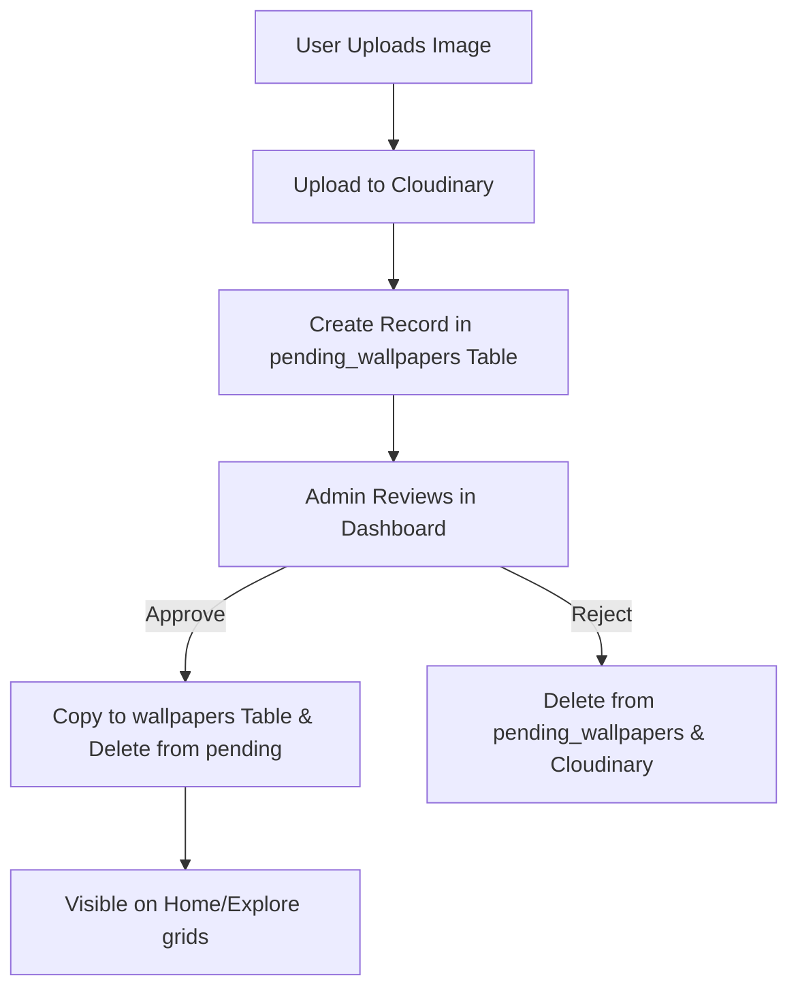

# 🖼️ FragVerse — Wallpaper Discovery & Community Platform

[](https://react.dev/)
[](https://vite.dev/)
[](https://tailwindcss.com/)
[](https://supabase.com/)
[](https://firebase.google.com/)
[](https://cloudinary.com/)
[](https://unsplash.com/developers)
[](#)
[](#)

> **Find the walls that feel like you.**
> FragVerse is a modern, high-performance wallpaper platform focused on gorgeous aesthetics, endless scroll discovery, and community curation.

---

## ✨ Core Features

* 🖼️ **Wallpaper Discovery**: Smooth, infinite scrolling masonry grids presenting high-quality landscape wallpapers.
* 🌌 **Community Uploads**: A seamless upload portal allowing authenticated users to share their own custom wallpapers.
* 🔐 **Secure Authentication**: Google sign-in integration powered by Firebase Authentication.
* ❤️ **Database-Synced Favorites**: Persistent user collections stored in Supabase that stay synchronized across sessions.
* 🛠️ **Admin Moderation Dashboard**: A dedicated dashboard for administrators to review, approve, or reject pending community submissions.
* 📱 **Fluid Mobile UI**: A fully responsive interface complete with smooth sliding side-drawer navigation and floating hamburger controls.
* 🎨 **Elegant Theme Switching**: Instant toggling between a clean, bright light mode and an immersive glassmorphic dark mode.

---

## 🌌 Community Upload & Moderation Flow

FragVerse hosts a curated collection that combines professional photography with user-generated submissions:



1. **Upload**: Logged-in users can click **Upload** on the navbar or sidebar, input the title, category, description, and tags, and upload the image file.
2. **Review**: The wallpaper is temporarily stored in a `pending_wallpapers` queue.
3. **Moderation**: Administrators log in to see the pending count on their sidebar and open the **Moderation Dashboard** to approve or reject items.

---

## ❤️ Persistent Favorites System

* Clicking the Heart button on any wallpaper card or fullscreen modal toggles its status.
* The favorite state is linked to the user's account and persists in a Supabase relational table (`favorites`).
* When logging in, FragVerse automatically syncs and fetches details for any saved items not currently loaded in the feed cache, ensuring a unified UI list.

---

## 🛠️ Technical Stack

| Category | Technology | Purpose |
| :--- | :--- | :--- |
| **Frontend** | React 19 + Vite | Component structure and fast building |
| **Styling** | Vanilla CSS + Tailwind | Fluid layouts, animations, and typography |
| **Database** | Supabase | Storage of approved, pending, and favorite wallpapers |
| **Auth** | Firebase Auth | Google Sign-in identity provider |
| **Images** | Cloudinary | Asset delivery, optimizations, and hosting |
| **API** | Unsplash API | Automatic feed backup and query fallback |

---

## 🚀 Getting Started

### Prerequisites
- Node.js (v18 or higher)
- A package manager (npm, yarn, or pnpm)

### Installation

1. **Clone the repository:**
   ```bash
   git clone https://github.com/seffhunnn/frag-verse-wallpaper-app.git
   cd frag-verse-wallpaper-app
   ```

2. **Install dependencies:**
   ```bash
   npm install
   ```

3. **Configure Environment Variables:**
   Copy the `.env.example` file to `.env` in the root directory:
   ```bash
   cp .env.example .env
   ```
   Open `.env` and insert your respective developer keys:
   ```env
   VITE_UNSPLASH_KEY=your_unsplash_access_key
   VITE_CLOUDINARY_CLOUD_NAME=your_cloudinary_name
   VITE_CLOUDINARY_UPLOAD_PRESET=your_preset_name
   VITE_SUPABASE_URL=your_supabase_project_url
   VITE_SUPABASE_ANON_KEY=your_supabase_anonymous_public_key
   VITE_FIREBASE_API_KEY=your_firebase_key
   VITE_FIREBASE_AUTH_DOMAIN=your_firebase_auth_domain
   VITE_FIREBASE_PROJECT_ID=your_firebase_project_id
   VITE_FIREBASE_APP_ID=your_firebase_app_id
   VITE_ADMIN_EMAIL=admin_account_email_for_dashboard_access
   ```

4. **Run the development server:**
   ```bash
   npm run dev
   ```
   Open [http://localhost:5173](http://localhost:5173) in your browser.

---

## 📁 Project Structure

```text
frag-verse-wallpaper-app/
├── public/                 # Static assets
├── supabase/               # Database schemas and sql setups
├── src/
│   ├── assets/             # Images and local logos
│   ├── components/         # Reusable UI components
│   │   ├── categories/     # Category pages and discovery elements
│   │   └── explore/        # Search grids and exploration elements
│   ├── constants/          # Application configurations and constants
│   ├── hooks/              # Custom react hooks (scrolling, layout, query feeds)
│   ├── pages/              # Main router page containers
│   ├── services/           # Api wrapper layer (Firebase, Supabase, Cloudinary)
│   ├── App.jsx             # Main router and state coordinator
│   ├── index.css           # Base reset & design tokens
│   └── main.jsx            # Entry point
```

---

## 👨‍💻 Author

**Mohd Saif**
- Passionate about building modern, visually striking, and responsive web applications.

---

## 📜 License

© 2026 Mohd Saif. All rights reserved.
This project is proprietary. You may not copy, distribute, or modify this code without explicit permission from the author.
