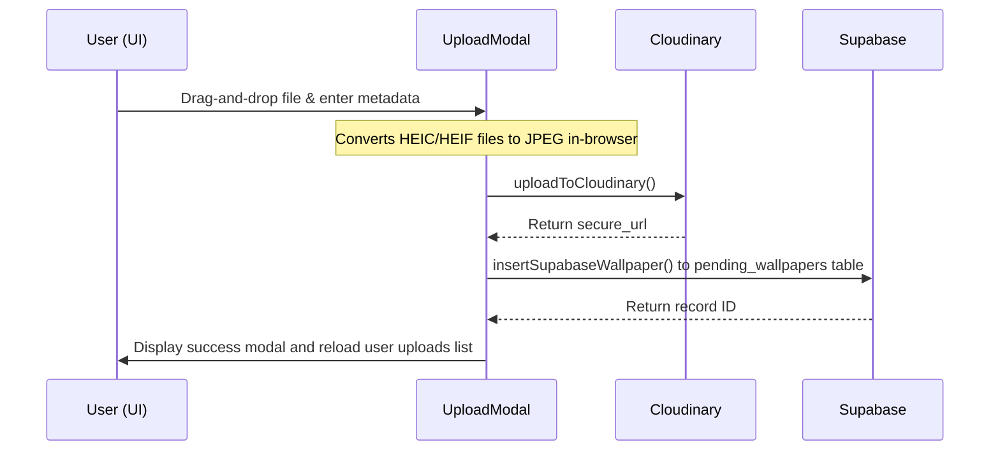

# FragVerse Codebase Overview

This document provides a technical walkthrough of the FragVerse internal codebase architecture, folder structure, core data flows, and performance-centric coding guidelines.

---

## 1. Project Architecture Overview

FragVerse is a React-based single-page application built on Vite and styled with a custom blend of Tailwind CSS and modern Vanilla CSS. It connects to multiple cloud backends and third-party APIs:

*   **Frontend & State Coordination**: Managed centrally by custom React hooks (such as [useWallpapers.js](file:///d:/frag-verse-wallpaper-app/src/hooks/useWallpapers.js)) and coordinated at the root level inside [App.jsx](file:///d:/frag-verse-wallpaper-app/src/App.jsx).
*   **Database & Storage (Supabase)**: Relational data storage for approved wallpapers (`wallpapers`), pending uploads (`pending_wallpapers`), and user favorites (`favorites`). Connection details are managed in [supabase.js](file:///d:/frag-verse-wallpaper-app/src/services/supabase.js) and database operations are encapsulated in [supabaseApi.js](file:///d:/frag-verse-wallpaper-app/src/services/supabaseApi.js).
*   **Authentication (Firebase)**: Google Sign-In is powered by Firebase Authentication, configured in [firebase.js](file:///d:/frag-verse-wallpaper-app/src/services/firebase.js) and integrated as a reactive listener inside [App.jsx](file:///d:/frag-verse-wallpaper-app/src/App.jsx).
*   **Image Management (Cloudinary)**: Handles image asset hosting, dynamic resizing, auto-format selection, and HEIC-to-JPG conversion. Implemented in [cloudinaryApi.js](file:///d:/frag-verse-wallpaper-app/src/services/cloudinaryApi.js).
*   **External Content Integration (Unsplash)**: Provides a fallback/backup library of aesthetic landscape wallpapers. It integrates curated content directly into the Home and Explore feeds, queries are managed in [unsplashApi.js](file:///d:/frag-verse-wallpaper-app/src/services/unsplashApi.js).
*   **Masonry Rendering**: Uses Javascript-based column distribution ([distributeByEstimatedHeight](file:///d:/frag-verse-wallpaper-app/src/components/explore/MasonryWallpaperGrid.jsx#L24-L45)) rather than pure CSS columns. This ensures that cards are appended to the shortest visual column to prevent layout shifts and uneven vertical gutters.

---

## 2. Folder Structure

The repository is structured logically to separate user interface elements, application state, and cloud integration layers:

```text
frag-verse-wallpaper-app/
├── public/                 # Static assets (favicons, browser meta)
├── supabase/               # Database schemas and setup SQL script
│   └── schema.sql          # Contains table structures, constraints, and indexes
├── src/
│   ├── assets/             # Brand logos and images
│   ├── components/         # Reusable presentation and layout components
│   │   ├── categories/     # Category discovery pages and specialized cards
│   │   ├── explore/        # Search inputs, mood filters, and masonry components
│   │   └── ...             # Global cards, modals, navigation drawers
│   ├── constants/          # Application configurations, mood mappings, helper utilities
│   │   └── discovery.js    # Seeded random algorithms, mood data lists, array shuffles
│   ├── hooks/              # Custom React hooks containing operational logic
│   │   ├── useColumnCount.js # Responsive window resize listener for layout calculations
│   │   ├── useHeroSlideshow.js # Manages header background transitions
│   │   └── useWallpapers.js # Central orchestrator for all search, feed, and page state
│   ├── pages/              # Main view screens (CategoriesPage, ExplorePage)
│   ├── services/           # Configuration files and API modules for Supabase, Firebase, Cloudinary
│   ├── App.jsx             # Root component; coordinates routes, global state, auth updates, modal triggers
│   ├── index.css           # Base styles, variable definitions, and global styling tokens
│   └── main.jsx            # Entry point; binds the React tree to the DOM
```

> [!NOTE]
> *No `src/lib` folder exists in this codebase.* Shared configurations are hosted directly within the `src/services` and `src/constants` folders.

---

## 3. Core Features Architecture

### Community Upload Flow


1. **HEIC Conversion**: If the user uploads a `.heic` or `.heif` image, [UploadModal.jsx](file:///d:/frag-verse-wallpaper-app/src/components/UploadModal.jsx#L93-L130) dynamically imports `heic2any` to perform client-side JPEG transcoding.
2. **Cloudinary Upload**: [cloudinaryApi.js](file:///d:/frag-verse-wallpaper-app/src/services/cloudinaryApi.js#L20-L67) utilizes an `XMLHttpRequest` (instead of fetch) to capture real-time progress events.
3. **Database Insertion**: On completion, a record is inserted into the `pending_wallpapers` table in Supabase via [supabaseApi.js](file:///d:/frag-verse-wallpaper-app/src/services/supabaseApi.js#L83-L119). The submission status defaults to `pending`.

### Favorites System
*   **Database Synchronization**: Connects `user_id` and `wallpaper_id` using a composite unique constraint in the `favorites` table to prevent duplicates.
*   **Redundant Ingestion Gate**: Inside [App.jsx](file:///d:/frag-verse-wallpaper-app/src/App.jsx#L82-L145), the codebase performs a pre-flight duplicate check against local state and catches Supabase unique constraint errors (code `23505`) gracefully.
*   **Lazy Resolution**: When logging in, the app pulls all favorited wallpaper IDs. If a favorited ID is missing from the local client cache, [App.jsx](file:///d:/frag-verse-wallpaper-app/src/App.jsx#L247-L338) asynchronously fetches it (from Supabase if it matches a UUID pattern, or Unsplash if it is an alphanumeric photo ID) to construct a complete favorites view.

### Authentication
*   **Listener Pattern**: Coordinated in [App.jsx](file:///d:/frag-verse-wallpaper-app/src/App.jsx#L443-L474) using Firebase's `onAuthStateChanged`.
*   **Local Storage Mirror**: User profile information is persisted locally in `localStorage` for instantaneous load-state restoration.
*   **Admin Dashboard Promotion**: If the logged-in email matches `VITE_ADMIN_EMAIL`, the admin state is activated, enabling moderation views and rendering administrative components.

### Admin Moderation
*   **Dashboard**: Coordinated in [AdminDashboard.jsx](file:///d:/frag-verse-wallpaper-app/src/components/AdminDashboard.jsx).
*   **Approval Transaction**: Handled via `approveSupabaseWallpaper` in [supabaseApi.js](file:///d:/frag-verse-wallpaper-app/src/services/supabaseApi.js#L161-L213). It fetches the pending record, copies it into the public `wallpapers` table, and deletes it from `pending_wallpapers`. The function implements a rollback mechanism: if deletion fails, it deletes the newly copied public record to prevent orphans.
*   **Rejection/Deletion**: Handled via `rejectSupabaseWallpaper` which permanently deletes the record from `pending_wallpapers`.

### Category Filtering
*   **Strict vs. Loose Queries**: The `fetchSupabaseWallpapers` API filters by category strictly (using `ilike`) or performs loose queries (using `or` matching on tags, authors, titles) based on whether it recognizes the search string as an active category name.

### Feeds Construction (Home vs. Explore)
*   **Home Feed**: Integrates Unsplash popular landscape photos with Supabase community uploads. Insertion algorithms ensure that Unsplash maintains priority in the first two slots, with community wallpapers blended in randomized, staggered positions.
*   **Explore Feed**: Cycles through a list of 23 pre-defined search terms based on the user's `sessionSeed`. It blends Unsplash results with community uploads, limiting the local uploads to 8 cards per page.

---

## 4. Pagination System

FragVerse uses different pagination approaches depending on the discovery context:

| Feature | Pagination Type | Trigger | Rendering Style |
| :--- | :--- | :--- | :--- |
| **Home Feed** | Infinite Scroll | Intersection Observer | Append-only scroll |
| **Explore Feed** | Load More Button | User Action (Button click) | Append-only grid |
| **Category/Search Feed**| Load More Button | User Action (Button click) | Append-only grid |

### Append-Only Rendering Approach
Whenever new pages are fetched, the new items are appended to the existing feeds state (e.g. `setHomeFeed` or `setExploreFeed`). The array values are cleaned through a deduplication map ([getUniqueById](file:///d:/frag-verse-wallpaper-app/src/hooks/useWallpapers.js#L101-L105)) using the item IDs as keys to prevent duplicated items.

### Stability Optimizations
1.  **Strict Load Gates**: Custom `useRef` loading gates (`homeLoadingRef`, `exploreLoadingRef`, etc.) are read synchronously by the scroll handler to block extra queries during network requests.
2.  **Stable Database Range**: Pagination in Supabase uses secondary ordering keys (`order('created_at').order('id')`) to prevent index drift and item skipping on subsequent page pulls.
3.  **Root-Margin Pre-fetching**: The Intersection Observer on the Home page triggers loading when the user scrolls within `800px` of the page bottom, offering a seamless scroll experience.

---

## 5. Database Structure

The Supabase schema is normalized and indexed to handle quick retrieval. Details are defined in [schema.sql](file:///d:/frag-verse-wallpaper-app/supabase/schema.sql):

### 1. `wallpapers` (Public Approved)
*   **`id`**: `uuid` (Primary Key, defaults to random UUID).
*   **`image_url`**: `text` (Points to Cloudinary asset).
*   **`category`**: `text` (Defaults to 'Other').
*   **`author`**: `text` (Defaults to 'Unknown').
*   **`title`**: `text` (Required).
*   **`tags`**: `text[]` (Array of tags, defaults to `{}`).
*   **`uploader_id`**: `text` (Firebase UID of the contributor).

### 2. `pending_wallpapers` (Moderation Queue)
*   Shares an identical schema to `wallpapers`.
*   Acts as a quarantine table. Submissions are only migrated to `wallpapers` upon approval.

### 3. `favorites` (Relational Link)
*   **`user_id`**: `text` (Firebase UID).
*   **`wallpaper_id`**: `text` (UUID or Unsplash string ID).
*   *Constraint*: Composite unique constraint `unique_user_wallpaper_favorite` on `(user_id, wallpaper_id)`.

### Indexes
*   Category indexes: `idx_wallpapers_category`, `idx_pending_wallpapers_category`.
*   Temporal indexes: `idx_wallpapers_created_at` (descending), `idx_pending_wallpapers_created_at`.
*   Uploader indexes: `idx_wallpapers_uploader_id`, `idx_pending_wallpapers_uploader_id`.
*   Favorites indexes: `idx_favorites_user_id`, `idx_favorites_wallpaper_id`.

---

## 6. Performance Optimizations

1.  **Height-Aware Masonry Columns**: Flex columns are pre-calculated in JavaScript using height ratios. In [WallpaperCard.jsx](file:///d:/frag-verse-wallpaper-app/src/components/WallpaperCard.jsx#L37-L57), clamped layouts (Explore, Categories) force a static `4:3` aspect ratio, meaning both Unsplash images and Supabase cards align without size mismatch. Non-clamped layouts (Home Grid) use real image metadata or hash-derived fallback aspect ratios.
2.  **Rerender Minimization**: Important visual elements are wrapped in `React.memo` (e.g., [WallpaperCard](file:///d:/frag-verse-wallpaper-app/src/components/WallpaperCard.jsx#L4), [MasonryWallpaperGrid](file:///d:/frag-verse-wallpaper-app/src/components/explore/MasonryWallpaperGrid.jsx#L48)). Event handlers in [App.jsx](file:///d:/frag-verse-wallpaper-app/src/App.jsx) are structured with `useCallback` to maintain reference stability.
3.  **Image Optimization Strategy**:
    *   **Cloudinary HEIC Dynamic Delivery**: HEIC images are optimized on Cloudinary by modifying URLs to inject format-auto (`f_auto`) and quality-auto (`q_auto`) parameters: `url.replace('/upload/', '/upload/f_auto,q_auto/')`.
    *   **Skeleton Underlay & Opacity Fades**: Skeletons render under images in absolute layout space. Images load lazily (`loading="lazy"` and `decoding="async"`) and smoothly transition opacity from `0` to `1` when complete, avoiding layout jumps.
    *   **will-change Compositing**: Columns in the masonry grid utilize `will-change: transform` to force GPU compositing, allowing smooth scroll rendering.

---

## 7. Important Development Rules

When writing code in this repository, strictly adhere to the following rules:

*   **Never Bypass Normalization**: Always wrap database results in `normalizeWallpapers` before committing them to React state to prevent runtime structure crashes.
*   **Maintain Masonry Gating**: Never modify the `IntersectionObserver` parameters or remove the `useRef` loading gates. Bypassing these gates creates network request loops that exhaust Unsplash API rate limits.
*   **Do Not Use Tailwind Arbitrary Values**: Avoid padding/margin definitions like `p-[17px]`. Maintain consistency by utilizing CSS tokens defined in [index.css](file:///d:/frag-verse-wallpaper-app/src/index.css) (such as `var(--surface)` and `var(--accent)`).
*   **Zero Logs Policy**: Keep builds clean. Remove all `console.log`, `console.debug`, and debugging flags before pushing code or initiating a production compile.

---

## 8. Contributor Notes

*   **Safe Development Areas**: Add styles or micro-animations in `index.css`. Build isolated filters or layout helpers inside `src/components/` and `src/utils/`.
*   **High-Risk Subsystems**: Avoid altering [useWallpapers.js](file:///d:/frag-verse-wallpaper-app/src/hooks/useWallpapers.js) or the Intersection Observer in [App.jsx](file:///d:/frag-verse-wallpaper-app/src/App.jsx#L718-L800) unless debugging pagination. Changes here risk causing state-clearing issues or infinite fetch loops.
*   **Integration Cleanliness**: Ensure all new backend integrations register their API endpoints within `src/services/` and maintain isolation from the visual rendering components.
